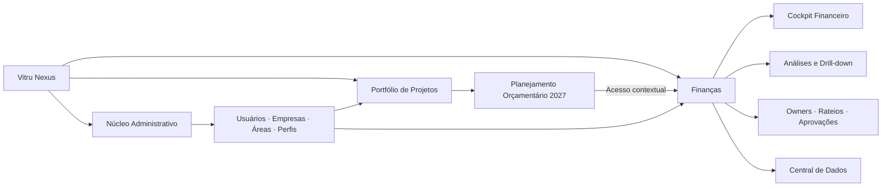
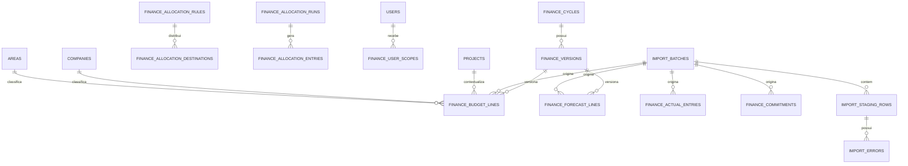
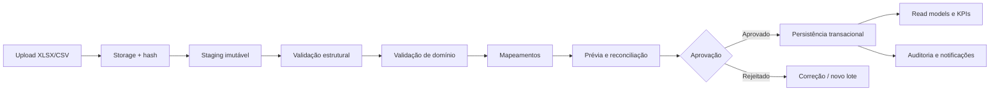

# Blueprint Executivo — Gestão Financeira e Investimentos

**Produto:** Vitru Nexus  
**Módulo:** Gestão Financeira e Investimentos da VP de Mercado  
**Vínculo estratégico:** Planejamento Orçamentário 2027  
**Status:** Proposta para validação; nenhuma estrutura financeira foi implementada  
**Data de referência:** 3 de setembro de 2026

## Conclusão executiva

O módulo financeiro deve ser **uma área autônoma dentro do Vitru Nexus**, e não uma nova aplicação nem mais uma aba do workspace universal. A recomendação é criar uma entrada principal **Finanças** no shell do NEXUS, com navegação, dados, permissões, importações e ritos próprios. O projeto **Planejamento Orçamentário 2027** continuará existindo como espaço de governança do processo — cronograma, decisões, documentos, responsáveis e planos de ação — e oferecerá um acesso direto ao módulo financeiro.

Essa separação resolve um conflito de produto importante. Projetos são temporários, orientados a entregas e decisões. A gestão financeira é contínua, multidimensional, versionada, sujeita a fechamentos, aprovações, rateios e cargas recorrentes. Inserir toda essa operação nas 13 abas de um projeto criaria navegação excessiva, permissões frágeis e uma experiência difícil de escalar.

> **Decisão recomendada:** um único produto e uma única identidade, com domínios distintos. O NEXUS compartilha autenticação, usuários, empresas, áreas, projetos, documentos, auditoria e notificações; Finanças acrescenta seu próprio modelo, suas páginas e suas regras de negócio.

| Princípio                     | Decisão                                                                                                      |
| ----------------------------- | ------------------------------------------------------------------------------------------------------------ |
| Produto                       | Um módulo nativo do Vitru Nexus, nunca uma aplicação paralela                                                |
| Entrada                       | Item principal `Finanças` no menu lateral                                                                    |
| Relação com Planejamento 2027 | Card e atalho para o módulo financeiro; governança do projeto permanece nas 13 seções                        |
| Fonte de dados do MVP         | Arquivos XLSX e CSV submetidos a staging, validação e aprovação                                              |
| Dados iniciais                | Nenhum valor financeiro será criado automaticamente                                                          |
| Comparativo prioritário       | 2025 × 2026, com estrutura preparada para 2027, versões e cenários                                           |
| Modelo analítico              | Dimensões compartilhadas + fatos separados para orçamento, realizado, comprometido, forecast e rateios       |
| Regra crítica                 | Orçado, realizado e comprometido permanecem conceitos distintos; nenhuma soma poderá produzir dupla contagem |

---

# 1. Diagnóstico

## 1.1 Necessidade de negócio

O problema não é falta de gráficos. O problema é a ausência de uma camada única e governada que permita reconstruir, do consolidado ao lançamento, **onde o recurso foi planejado, realizado, comprometido, projetado, rateado e atribuído**. Hoje, responder às perguntas executivas exige combinar dimensões organizacionais, financeiras e de investimento que possuem granularidades diferentes.

O módulo precisa atender simultaneamente a três níveis de decisão:

| Nível               | Pergunta central                              | Experiência necessária                                       |
| ------------------- | --------------------------------------------- | ------------------------------------------------------------ |
| Executivo           | Onde estão os desvios, riscos e decisões?     | Cockpit curto, por exceção, com drill-down                   |
| Gestor/owner        | Qual verba é minha e o que preciso corrigir?  | Responsabilidade financeira, compromissos e plano de ação    |
| Financeiro/analista | O dado está correto, reconciliado e aprovado? | Central de dados, validação, mapeamento, rateios e auditoria |

O conceito **Casa** representa custos atribuídos diretamente a uma estrutura. O conceito **Condomínio** representa custos compartilhados que permanecem vinculados à origem e geram movimentos derivados de rateio. O valor original nunca deve ser sobrescrito; os destinos são registrados em um fato de alocação, preservando a reconciliação.

## 1.2 Diagnóstico da arquitetura atual

O Vitru Nexus já fornece os ativos transversais necessários: autenticação, RBAC, empresas, modalidades, áreas, usuários, projetos, documentos em storage, auditoria, notificações, React, TypeScript, tRPC, Drizzle e MySQL. O módulo financeiro deve reutilizar esses ativos e acrescentar apenas os conceitos que não existem.

| Reutilizar do NEXUS           | Acrescentar em Finanças                                         |
| ----------------------------- | --------------------------------------------------------------- |
| Usuários e autenticação       | Escopos financeiros por empresa, área, centro de custo e verba  |
| Empresas, modalidades e áreas | Marca, BU, produto, centro de custo e contas                    |
| Projetos e responsáveis       | Iniciativas, campanhas, contratos e owners financeiros          |
| RBAC e permissões             | Permissões financeiras de importar, aprovar, revisar e reverter |
| Documentos e storage          | Arquivos-fonte e evidências dos lotes de carga                  |
| Auditoria e notificações      | Aprovações, rejeições, substituições e alertas de desvio        |

---

# 2. Arquitetura funcional

## 2.1 Fronteiras do módulo



O projeto Planejamento Orçamentário 2027 governa **como o planejamento é conduzido**. O módulo financeiro governa **os valores, versões, lançamentos, compromissos e análises**. Uma decisão financeira poderá gerar uma decisão ou ação no projeto; um documento do projeto poderá ser referenciado em um lote, mas os dois contextos não dividirão a mesma navegação.

## 2.2 Capabilidades

| Capabilidade        | Responsabilidade                                                  |
| ------------------- | ----------------------------------------------------------------- |
| Planejamento        | Exercícios, versões, orçamento original, revisado e forecast      |
| Execução financeira | Realizado, compromissos, saldo e competência                      |
| Investimentos       | Pilar, canal, projeto, iniciativa, campanha e fornecedor          |
| Responsabilidade    | Owner, estrutura proprietária, verba e alçadas                    |
| Rateios             | Casa, Condomínio, critérios, bases, destinos e memória de cálculo |
| Analytics           | KPIs, comparativos, tendências, desvios e drill-down              |
| Central de Dados    | Upload, staging, validação, mapeamento, aprovação e reversão      |
| Governança          | Aprovações, auditoria, notificações, comentários e decisões       |

## 2.3 Fluxo de decisão

O usuário inicia no cockpit, identifica uma exceção, abre o recorte responsável, atravessa as dimensões até chegar ao lançamento e registra o encaminhamento no contexto correto. O drill-down recomendado é:

> Vitru → empresa → marca → BU/modalidade → área → pilar → canal → projeto → iniciativa/campanha → fornecedor/contrato → lançamento.

O sistema deve preservar a seleção dos filtros durante a navegação, permitir copiar um link com o contexto e mostrar sempre qual versão, exercício, moeda e período de corte sustentam a análise.

---

# 3. Mapa de telas

| Grupo         | Tela                          | Função principal                                                                   |
| ------------- | ----------------------------- | ---------------------------------------------------------------------------------- |
| Entrada       | Finanças                      | Landing do módulo, período ativo, versão aprovada e atalhos                        |
| Executivo     | Cockpit Financeiro            | Orçamento, realizado, comprometido, forecast, saldo, desvios, tendência e decisões |
| Análise       | Orçamento × Realizado         | Comparar medidas por período e navegar pelas dimensões                             |
| Análise       | Comprometimentos              | Exibir recursos assumidos, valor em aberto, vencimento e cobertura no forecast     |
| Análise       | Investimentos                 | Ler composição por pilar, canal, projeto, iniciativa, campanha e fornecedor        |
| Governança    | Responsabilidade Financeira   | Consolidar verbas, owners, execução, saldo e desvios por responsável               |
| Governança    | Fornecedores                  | Expor concentração, contratos, evolução e objetos relacionados                     |
| Governança    | Rateios                       | Visualizar Casa/Condomínio, critérios, bases, destinos e reconciliação             |
| Operação      | Central de Dados              | Criar lote, enviar arquivo, validar, mapear, aprovar e acompanhar histórico        |
| Operação      | Detalhe do Lote               | Resumo, linhas aceitas/rejeitadas, erros, mapeamentos e aprovação                  |
| Administração | Cadastros Financeiros         | Gerir dimensões que não existem no núcleo do NEXUS                                 |
| Administração | Exercícios e Versões          | Abrir, aprovar, bloquear e superseder versões                                      |
| Administração | Regras e Alçadas              | Configurar escopos, aprovadores e tolerâncias                                      |
| Contexto      | Detalhe Financeiro do Projeto | Visão financeira filtrada por um projeto NEXUS, sem substituir seu workspace       |

### Rotas propostas

| Rota                            | Tela                        |
| ------------------------------- | --------------------------- |
| `/finance`                      | Cockpit Financeiro          |
| `/finance/budget-vs-actual`     | Orçamento × Realizado       |
| `/finance/commitments`          | Comprometimentos            |
| `/finance/investments`          | Investimentos               |
| `/finance/responsibility`       | Responsabilidade Financeira |
| `/finance/vendors`              | Fornecedores                |
| `/finance/allocations`          | Rateios                     |
| `/finance/data-center`          | Central de Dados            |
| `/finance/data-center/:batchId` | Detalhe do lote             |
| `/finance/admin/dimensions`     | Cadastros Financeiros       |
| `/finance/admin/cycles`         | Exercícios e versões        |
| `/finance/admin/access`         | Escopos e alçadas           |

---

# 4. Jornadas do usuário

## 4.1 Executivo

O executivo entra em Finanças e recebe primeiro o período de corte, versão e grau de completude dos dados. A segunda camada apresenta seis KPIs: orçamento revisado, realizado YTD, comprometido em aberto, forecast de fechamento, saldo pós-compromissos e desvio projetado. A terceira camada mostra somente as maiores exceções, os owners e as decisões necessárias.

Ao selecionar um desvio, a interface abre o drill-down já filtrado. O executivo pode registrar uma decisão, atribuir um responsável e prazo ou abrir o contexto do projeto relacionado. Nenhuma edição de lançamento acontece nessa jornada.

## 4.2 Gestor ou owner de orçamento

O gestor acessa **Minha responsabilidade financeira**, visualiza as verbas sob sua alçada e entende o que já ocorreu, o que está comprometido e o que está projetado. Ele abre a causa por pilar, canal, iniciativa e fornecedor, comenta uma divergência e submete uma revisão ou justificativa conforme sua permissão.

## 4.3 Financeiro ou analista

O analista cria um lote, seleciona o tipo de dado e envia XLSX ou CSV. O arquivo é guardado no storage, recebe hash e entra em staging. O sistema valida estrutura, tipos, duplicidades e cadastros, apresenta erros por linha, sugere mapeamentos e calcula uma prévia de impacto. Somente após aprovação o lote atualiza fatos analíticos. Substituições e reversões geram novos eventos; dados anteriores não são apagados silenciosamente.

## 4.4 Administrador financeiro

O administrador abre exercícios e versões, gerencia dimensões, configura tolerâncias, alçadas e escopos. Não administra autenticação nem empresas em duplicidade; esses cadastros continuam no núcleo do NEXUS.

---

# 5. Arquitetura de dados

## 5.1 Princípio de modelagem

Recomenda-se um modelo relacional normalizado para operação e uma camada de leitura analítica composta por views/read models. Os fatos permanecem separados porque possuem grãos distintos. A interface não calculará regras financeiras críticas; consumirá métricas produzidas pelo backend.



## 5.2 Entidades propostas

### Dimensões compartilhadas

`users`, `companies`, `areas`, `modalities` e `projects` serão reutilizadas. Nenhuma cópia será criada no domínio financeiro.

### Dimensões financeiras e de investimento

| Entidade                      | Finalidade                            | Relação principal                      |
| ----------------------------- | ------------------------------------- | -------------------------------------- |
| `finance_brands`              | Marca vinculada à empresa             | `companyId`                            |
| `finance_business_units`      | Unidade de negócio                    | empresa e marca opcionais              |
| `finance_products`            | Produto gerencial                     | BU e modalidade opcionais              |
| `finance_cost_centers`        | Centro de custo                       | empresa, área e owner                  |
| `finance_accounting_accounts` | Conta contábil de origem              | código externo único por origem        |
| `finance_management_accounts` | Agrupamento gerencial                 | recebe contas contábeis                |
| `finance_natures`             | Classificação da despesa/investimento | tipo e comportamento                   |
| `finance_pillars`             | Pilar de investimento                 | parametrizável                         |
| `finance_channels`            | Canal de investimento                 | parametrizável                         |
| `finance_initiatives`         | Iniciativa financeira                 | projeto NEXUS opcional                 |
| `finance_campaigns`           | Campanha                              | iniciativa e canal                     |
| `finance_vendors`             | Fornecedor                            | identificador fiscal opcional e status |
| `finance_contracts`           | Contrato                              | fornecedor, vigência, owner e projeto  |
| `finance_periods`             | Calendário financeiro                 | exercício, mês e estado de fechamento  |

### Planejamento e execução

| Entidade                 | Grão                                      | Medida principal                   |
| ------------------------ | ----------------------------------------- | ---------------------------------- |
| `finance_cycles`         | um exercício                              | período e status                   |
| `finance_versions`       | ciclo × versão × tipo                     | original, revisão ou forecast      |
| `finance_budget_lines`   | versão × mês × combinação dimensional     | valor orçado                       |
| `finance_actual_entries` | lançamento/documento × linha              | valor realizado                    |
| `finance_commitments`    | compromisso/contrato/pedido × competência | valor original, realizado e aberto |
| `finance_forecast_lines` | versão × mês × combinação dimensional     | valor projetado                    |

### Rateios

| Entidade                          | Finalidade                                |
| --------------------------------- | ----------------------------------------- |
| `finance_allocation_rules`        | Regra, origem, critério, vigência e owner |
| `finance_allocation_destinations` | Destinos e percentuais/drivers da regra   |
| `finance_allocation_runs`         | Execução versionada do rateio por período |
| `finance_allocation_entries`      | Valores derivados por origem e destino    |

### Ingestão e auditoria

| Entidade                      | Finalidade                                           |
| ----------------------------- | ---------------------------------------------------- |
| `finance_import_batches`      | Cabeçalho do lote, hash, arquivo, status e contagens |
| `finance_import_staging_rows` | Linha bruta normalizada antes da aprovação           |
| `finance_import_errors`       | Erros por linha, campo, código e severidade          |
| `finance_mapping_rules`       | Tradução entre valor da origem e cadastro NEXUS      |
| `finance_batch_approvals`     | Decisão, usuário, data e comentário                  |
| `finance_batch_events`        | Histórico imutável do ciclo de vida do lote          |
| `finance_user_scopes`         | Escopo de leitura/escrita por usuário e dimensão     |

## 5.3 Relações e integridade

Uma versão aprovada será imutável. Qualquer revisão criará uma nova versão. Lotes aprovados serão append-only; substituição ou reversão criará eventos compensatórios. Linhas financeiras guardarão `batchId`, `sourceRecordId` e hash de negócio para rastreabilidade e prevenção de duplicidade.

O modelo analítico será exposto por uma view canônica que une os fatos com uma coluna `measureType`, sem fundi-los fisicamente. Isso permite comparar orçamento, realizado, comprometido e forecast em um mesmo gráfico sem perder o grão original.

---

# 6. Data Dictionary essencial

## 6.1 Campos comuns às linhas financeiras

| Campo                 | Tipo          | Obrigatório     | Definição e regra                                                            |
| --------------------- | ------------- | --------------- | ---------------------------------------------------------------------------- |
| `sourceRecordId`      | varchar(160)  | Sim             | Identificador único da linha no sistema de origem; participa da deduplicação |
| `fiscalYear`          | smallint      | Sim             | Exercício no formato AAAA                                                    |
| `period`              | char(7)       | Sim             | Competência `AAAA-MM`                                                        |
| `currency`            | char(3)       | Sim             | Código monetário; MVP recomendado `BRL`                                      |
| `companyId`           | FK            | Sim             | Empresa existente no NEXUS                                                   |
| `brandId`             | FK            | Conforme regra  | Marca financeira ativa                                                       |
| `businessUnitId`      | FK            | Não             | BU ativa                                                                     |
| `modalityId`          | FK            | Não             | Modalidade existente no NEXUS                                                |
| `productId`           | FK            | Não             | Produto financeiro ativo                                                     |
| `areaId`              | FK            | Sim             | Área existente no NEXUS                                                      |
| `costCenterId`        | FK            | Sim             | Centro de custo ativo                                                        |
| `accountingAccountId` | FK            | Conforme origem | Conta contábil                                                               |
| `managementAccountId` | FK            | Sim             | Conta gerencial consolidada                                                  |
| `natureId`            | FK            | Sim             | Natureza financeira                                                          |
| `ownershipType`       | enum          | Sim             | `HOUSE` ou `CONDO`                                                           |
| `pillarId`            | FK            | Não             | Pilar de investimento                                                        |
| `channelId`           | FK            | Não             | Canal de investimento                                                        |
| `projectId`           | FK            | Não             | Projeto existente no NEXUS                                                   |
| `initiativeId`        | FK            | Não             | Iniciativa financeira                                                        |
| `campaignId`          | FK            | Não             | Campanha                                                                     |
| `vendorId`            | FK            | Não             | Fornecedor                                                                   |
| `contractId`          | FK            | Não             | Contrato                                                                     |
| `ownerUserId`         | FK            | Sim             | Usuário responsável pela verba                                               |
| `amount`              | decimal(20,2) | Sim             | Valor na moeda informada; sinal conforme política de carga                   |
| `batchId`             | FK            | Sim             | Lote aprovado que originou a linha                                           |
| `createdAt`           | timestamp UTC | Sim             | Data de persistência                                                         |

## 6.2 Campos específicos

| Objeto      | Campos adicionais essenciais                                                                                                                   |
| ----------- | ---------------------------------------------------------------------------------------------------------------------------------------------- |
| Orçamento   | `versionId`, `budgetAmount`, `justification`                                                                                                   |
| Realizado   | `postingDate`, `documentNumber`, `lineNumber`, `reversalOfSourceRecordId`, `description`                                                       |
| Compromisso | `commitmentType`, `commitmentDate`, `expectedDate`, `documentNumber`, `originalAmount`, `realizedAmount`, `openAmount`, `status`               |
| Forecast    | `versionId`, `forecastAmount`, `assumptionNote`                                                                                                |
| Rateio      | `ruleId`, `runId`, `sourceFactType`, `sourceFactId`, `destinationType`, `destinationId`, `driverValue`, `allocationPercent`, `allocatedAmount` |
| Lote        | `fileKey`, `fileName`, `fileHash`, `sourceSystem`, `loadType`, `mode`, `status`, `rowCount`, `acceptedCount`, `rejectedCount`, `versionNumber` |

O dicionário detalhado de cada coluna do template será entregue no arquivo XLSX, na aba `DICIONARIO`.

---

# 7. Arquitetura de importação

## 7.1 Pipeline proposto



## 7.2 Decisões técnicas

O arquivo original ficará no storage externo. O banco armazenará metadados, hash e staging normalizado. O parser não gravará diretamente nos fatos. Para o MVP em hospedagem autoscale, recomenda-se limitar cada arquivo a **20 MB ou 100 mil linhas**, sujeito à validação do volume real. Arquivos maiores exigirão processamento assíncrono em ambiente com worker persistente.

Cada lote terá modo `APPEND`, `REPLACE_SCOPE` ou `REVERSAL`. `APPEND` adiciona linhas não duplicadas; `REPLACE_SCOPE` substitui um recorte explicitamente aprovado; `REVERSAL` gera movimentos compensatórios. Nenhum modo executará exclusão silenciosa.

## 7.3 Estados do lote

| Estado              | Significado                                |
| ------------------- | ------------------------------------------ |
| `UPLOADED`          | Arquivo armazenado, ainda não processado   |
| `STAGING`           | Linhas sendo normalizadas                  |
| `VALIDATION_FAILED` | Existem erros bloqueantes                  |
| `MAPPING_REQUIRED`  | Há valores sem correspondência de cadastro |
| `READY_FOR_REVIEW`  | Prévia e reconciliação disponíveis         |
| `APPROVAL_PENDING`  | Submetido ao aprovador                     |
| `APPROVED`          | Aprovado, aguardando persistência          |
| `COMMITTED`         | Fatos gravados e read models atualizados   |
| `REJECTED`          | Rejeitado com justificativa                |
| `REVERSED`          | Efeito compensado por operação posterior   |

## 7.4 Mapeamento

Valores desconhecidos não criarão cadastros automaticamente. O usuário deverá mapear para um código existente, solicitar criação ou excluir a linha do lote. O mapeamento aprovado poderá ser salvo como regra reutilizável por origem, dimensão e vigência.

---

# 8. Template de carga

## 8.1 Decisão recomendada

O MVP deve adotar **um tipo de dado por lote**. Essa regra torna aprovação, substituição, reversão e reconciliação mais seguras. O usuário baixa um template específico — orçamento, realizado, comprometido, forecast ou rateio — e envia um arquivo por vez. Um workbook mestre acompanhará o Blueprint apenas como referência das estruturas.

| Template     | Aba de dados   | Chave de negócio recomendada                                 |
| ------------ | -------------- | ------------------------------------------------------------ |
| Orçamento    | `ORCAMENTO`    | versão + período + combinação dimensional + `sourceRecordId` |
| Realizado    | `REALIZADO`    | origem + documento + linha + período                         |
| Comprometido | `COMPROMETIDO` | origem + documento + linha + competência                     |
| Forecast     | `FORECAST`     | versão + período + combinação dimensional + `sourceRecordId` |
| Rateios      | `RATEIOS`      | regra + período + origem + destino                           |
| Cadastros    | `CADASTROS`    | tipo de dimensão + código externo + vigência                 |

O workbook de referência conterá também `LEIA-ME` e `DICIONARIO`. As células de entrada usarão fonte azul; cálculos, quando existirem, usarão preto; referências entre abas usarão verde. Todo valor manual deverá ter comentário de fonte, período e origem.

## 8.2 Colunas do template de orçamento

| Coluna                    | Obrigatória    | Exemplo de formato                            |
| ------------------------- | -------------- | --------------------------------------------- |
| `source_record_id`        | Sim            | `BUD-2026-000001`                             |
| `fiscal_year`             | Sim            | `2026`                                        |
| `period`                  | Sim            | `2026-01`                                     |
| `version_code`            | Sim            | `ORIGINAL` ou código cadastrado               |
| `currency`                | Sim            | `BRL`                                         |
| `company_code`            | Sim            | código do cadastro                            |
| `brand_code`              | Conforme regra | código do cadastro                            |
| `business_unit_code`      | Não            | código do cadastro                            |
| `modality_code`           | Não            | código do cadastro                            |
| `product_code`            | Não            | código do cadastro                            |
| `area_code`               | Sim            | código do cadastro                            |
| `cost_center_code`        | Sim            | código do cadastro                            |
| `management_account_code` | Sim            | código do cadastro                            |
| `nature_code`             | Sim            | código do cadastro                            |
| `ownership_type`          | Sim            | `HOUSE` ou `CONDO`                            |
| `pillar_code`             | Não            | código do cadastro                            |
| `channel_code`            | Não            | código do cadastro                            |
| `project_code`            | Não            | código do NEXUS                               |
| `initiative_code`         | Não            | código do cadastro                            |
| `campaign_code`           | Não            | código do cadastro                            |
| `vendor_code`             | Não            | código do cadastro                            |
| `contract_code`           | Não            | código do cadastro                            |
| `owner_email`             | Sim            | e-mail do usuário NEXUS                       |
| `amount`                  | Sim            | decimal com duas casas, sem símbolo monetário |
| `description`             | Não            | texto de apoio                                |
| `source_note`             | Sim            | origem documental ou sistêmica                |

Os templates de realizado, comprometido e forecast reutilizam as dimensões e acrescentam apenas seus campos específicos. O arquivo XLSX entregue com este Blueprint detalha todas as colunas.

---

# 9. Regras de validação

## 9.1 Camadas de validação

| Camada        | Exemplos                                                             | Severidade                           |
| ------------- | -------------------------------------------------------------------- | ------------------------------------ |
| Arquivo       | extensão, tamanho, arquivo corrompido, aba esperada                  | Bloqueante                           |
| Estrutura     | cabeçalhos, colunas obrigatórias, coluna desconhecida                | Bloqueante ou aviso                  |
| Tipo          | data, decimal, inteiro, enum, comprimento                            | Bloqueante                           |
| Integridade   | empresa, área, centro de custo, conta, owner e fornecedor existentes | Mapeamento ou bloqueante             |
| Período       | exercício aberto, competência válida, versão compatível              | Bloqueante                           |
| Negócio       | combinação dimensional permitida, contrato vigente, owner autorizado | Bloqueante                           |
| Duplicidade   | hash do arquivo, `sourceRecordId`, chave de negócio                  | Bloqueante ou substituição explícita |
| Reconciliação | soma de origem, soma de destino, total de rateio igual a 100%        | Bloqueante                           |
| Qualidade     | descrição vazia, concentração atípica, valor fora de tolerância      | Aviso                                |

## 9.2 Códigos de erro

Cada erro deve ter `errorCode`, `rowNumber`, `fieldName`, `receivedValue`, `message`, `severity` e `suggestedAction`. Exemplos: `F_REQUIRED`, `F_INVALID_DATE`, `D_COMPANY_NOT_FOUND`, `D_OWNER_NOT_FOUND`, `B_DUPLICATE_RECORD`, `B_CLOSED_PERIOD`, `A_ALLOCATION_NOT_100`.

## 9.3 Regras de substituição e reversão

Uma substituição deverá declarar exatamente seu escopo: tipo de fato, exercício, versão, período e dimensões de corte. Antes da aprovação, a prévia mostrará quantidade e valor que saem, entram e variam. A reversão preservará o lote original e produzirá movimentos de sinal oposto, vinculados ao evento de reversão.

---

# 10. Biblioteca de KPIs

## 10.1 Convenção de sinais

O MVP deverá tratar gastos e investimentos como valores positivos para leitura gerencial. Assim, um desvio positivo de forecast contra orçamento representa **pressão desfavorável**. Receitas, quando entrarem em evolução futura, terão semântica própria e não compartilharão automaticamente as mesmas cores.

| KPI                      | Fórmula de backend                                              | Regra de leitura                                               |
| ------------------------ | --------------------------------------------------------------- | -------------------------------------------------------------- |
| Orçamento Original       | `Σ budgetAmount` da versão original aprovada                    | Baseline aprovado do exercício                                 |
| Orçamento Revisado       | `Σ budgetAmount` da versão orçamentária vigente e aprovada      | Snapshot integral; não somar versões                           |
| Realizado YTD            | `Σ actualAmount` líquido de reversões até o período de corte    | Somente competências fechadas ou classificadas como realizadas |
| Comprometido em Aberto   | `Σ max(originalAmount - realizedAgainstCommitment, 0)`          | Não inclui parcela já realizada                                |
| Forecast de Fechamento   | `Σ forecastAmount` da versão vigente                            | Deve representar o ano completo                                |
| Saldo Disponível         | `Orçamento Revisado - Realizado YTD - Comprometido em Aberto`   | Liquidez gerencial ainda não consumida ou comprometida         |
| Desvio Realizado YTD     | `Realizado YTD - Orçamento Revisado YTD`                        | Positivo = acima do orçamento de gasto                         |
| Desvio Realizado %       | `Desvio Realizado YTD / Orçamento Revisado YTD`                 | Nulo quando o denominador for zero                             |
| Desvio de Fechamento     | `Forecast de Fechamento - Orçamento Revisado`                   | Positivo = pressão projetada                                   |
| % Orçamento Consumido    | `Realizado YTD / Orçamento Revisado YTD`                        | Comparação no mesmo recorte temporal                           |
| % Orçamento Comprometido | `(Realizado YTD + Comprometido em Aberto) / Orçamento Revisado` | Exposição total já consumida ou assumida                       |
| Saldo Pós-Forecast       | `Orçamento Revisado - Forecast de Fechamento`                   | Positivo = folga; negativo = estouro projetado                 |
| YoY Realizado            | `(Realizado YTD atual / Realizado YTD anterior comparável) - 1` | Mesma janela, calendário e mapeamento                          |
| Run Rate Mensal          | `Realizado YTD / meses fechados`                                | Não usar mês parcial sem sinalização                           |
| Projeção Run Rate        | `Realizado YTD + Run Rate × meses restantes`                    | Fallback analítico; não substitui forecast aprovado            |
| Acurácia do Forecast     | `1 - abs(Realizado - Forecast congelado) / abs(Realizado)`      | Avaliada após fechamento; tratar realizado zero                |

## 10.2 Hierarquia no cockpit

Os seis indicadores principais serão Orçamento Revisado, Realizado YTD, Comprometido em Aberto, Forecast de Fechamento, Saldo Disponível e Desvio de Fechamento. Os demais aparecem como diagnóstico. Nenhum KPI será exibido sem período, versão, moeda e data de atualização.

## 10.3 Faróis

Tolerâncias serão parametrizáveis por KPI e escopo. Como ponto de partida conceitual, o farol deve comparar o desvio com a tolerância cadastrada; o Blueprint não fixa percentuais arbitrários. Cinza significa dado ausente ou não aplicável, nunca desempenho neutro.

---

# 11. Wireframes conceituais

## 11.1 Cockpit Financeiro

```text
┌ Período | Versão | Moeda | Atualização | Qualidade do dado ─────────────┐
│ Orçamento │ Realizado │ Comprometido │ Forecast │ Saldo │ Desvio          │
├───────────────────────────────┬────────────────────────────────────────────┤
│ Tendência mensal             │ Principais desvios por impacto             │
│ Orç. · Real. · Comp. · Fcst. │ Farol · dimensão · owner · valor · ação    │
├───────────────────────────────┼────────────────────────────────────────────┤
│ Composição do investimento   │ Decisões financeiras pendentes             │
│ Pilar · canal · marca        │ responsável · prazo · impacto              │
└───────────────────────────────┴────────────────────────────────────────────┘
```

O cockpit não deve abrir com uma tabela. Primeiro mostra a situação, depois as exceções e, por fim, o caminho para a causa.

## 11.2 Orçamento × Realizado

```text
┌ Barra de filtros persistente + breadcrumbs do drill-down ─────────────────┐
│ KPI do recorte │ tendência │ ponte de variação │ contribuição por dimensão │
├────────────────────────────────────────────────────────────────────────────┤
│ Dimensão       │ Orçado │ Realizado │ Comp. │ Forecast │ Desvio │ Farol   │
│ Empresa A  >   │        │           │       │          │        │         │
│ Empresa B  >   │        │           │       │          │        │         │
└────────────────────────────────────────────────────────────────────────────┘
```

Rótulos e valores numéricos serão centralizados, exceto a coluna dimensional. Toda linha terá farol ou temperatura de desvio.

## 11.3 Central de Dados

```text
Upload → Validação → Mapeamento → Prévia → Aprovação → Concluído

┌ Resumo do lote ─────────────────┬ Erros e mapeamentos ─────────────────────┐
│ arquivo, hash, tipo, usuário     │ linha, campo, valor, erro, ação          │
│ linhas, aceitas, rejeitadas      │ mapear | solicitar cadastro | excluir   │
├──────────────────────────────────┴──────────────────────────────────────────┤
│ Reconciliação: valor anterior | sai | entra | variação | status            │
└────────────────────────────────────────────────────────────────────────────┘
```

---

# 12. Drill-down gerencial

O drill-down não será uma árvore fixa. O usuário poderá alterar a próxima dimensão, mantendo o recorte atual. A sequência padrão será sugerida pela pergunta de negócio.

| Pergunta                               | Caminho recomendado                                       |
| -------------------------------------- | --------------------------------------------------------- |
| Onde está o desvio?                    | Empresa → marca → BU → área → conta gerencial             |
| Onde o investimento se concentra?      | Pilar → canal → projeto → iniciativa → campanha           |
| Quem responde?                         | Owner → verba → iniciativa → fornecedor → lançamento      |
| Qual fornecedor pressiona o orçamento? | Fornecedor → contrato → projeto → lançamento              |
| Como o Condomínio foi distribuído?     | Regra → origem → critério → destino → lançamento derivado |

Cada nível exibirá breadcrumb, KPIs recalculados, contribuição para o desvio, posição no total e próxima ação possível. O usuário poderá alternar entre tabela, evolução mensal e ponte de variação sem perder o contexto.

---

# 13. Segurança e permissões

## 13.1 Perfis de referência

| Perfil                    | Escopo padrão          | Capacidades                                            |
| ------------------------- | ---------------------- | ------------------------------------------------------ |
| Administrador NEXUS       | Plataforma             | Usuários, perfis e configuração global                 |
| Administrador Financeiro  | Financeiro completo    | Ciclos, versões, cadastros, escopos e reversões        |
| Financeiro                | Escopo atribuído       | Importar, validar, mapear e submeter                   |
| Gestor                    | Empresa/área/BU        | Visualizar, justificar, revisar e comentar             |
| Responsável por Orçamento | Verbas atribuídas      | Visualizar detalhe, registrar forecast e justificativa |
| Executivo                 | Consolidado autorizado | Visualizar cockpit, drill-down e decisões              |
| Consulta                  | Escopo mínimo          | Somente leitura e exportação autorizada                |

## 13.2 Matriz de permissões

| Permissão                   | Admin Fin. | Financeiro |   Gestor   |     Owner      | Executivo | Consulta |
| --------------------------- | :--------: | :--------: | :--------: | :------------: | :-------: | :------: |
| `finance.view`              |     ✓      |     ✓      |     ✓      |       ✓        |     ✓     |    ✓     |
| `finance.import`            |     ✓      |     ✓      |     —      |       —        |     —     |    —     |
| `finance.map`               |     ✓      |     ✓      |     —      |       —        |     —     |    —     |
| `finance.submit`            |     ✓      |     ✓      |     —      |       —        |     —     |    —     |
| `finance.approve`           |     ✓      | por alçada | por alçada |       —        |     —     |    —     |
| `finance.adjust_forecast`   |     ✓      |     ✓      |     ✓      | escopo próprio |     —     |    —     |
| `finance.reverse_batch`     |     ✓      |     —      |     —      |       —        |     —     |    —     |
| `finance.manage_dimensions` |     ✓      |     —      |     —      |       —        |     —     |    —     |
| `finance.manage_scopes`     |     ✓      |     —      |     —      |       —        |     —     |    —     |

A permissão funcional será combinada com escopo de dados. Ter `finance.view` não concede automaticamente acesso a todas as empresas. Toda consulta no backend aplicará o escopo antes da agregação para evitar vazamento por totalizadores.

---

# 14. Roadmap

## MVP — Fundação governada

O MVP entrega Cockpit Financeiro, Orçamento × Realizado, Comprometimentos, Investimentos, Responsabilidade, Fornecedores, Rateios e Central de Dados. Inclui comparação 2025 × 2026, versões, upload XLSX/CSV, staging, validação, mapeamento, aprovação, reversão, RBAC, auditoria e drill-down. O resultado depende de arquivos oficiais; nenhuma integração corporativa é simulada.

## Evolução 2 — Planejamento e colaboração

A segunda evolução acrescenta workflow de proposta e aprovação de orçamento 2027, ciclos de forecast, comentários por linha, justificativas, alertas parametrizáveis, cenários e expansão das alçadas. Pode incorporar mapas de responsabilidade, pacotes de decisão e integração documental mais profunda.

## Evolução 3 — Automação e performance

A terceira evolução conecta ERP, banco corporativo, SharePoint/OneDrive e camada analítica. Depois da governança financeira estabilizada, relaciona investimento a lead, inscrito, matrícula, pagamento e receita, produzindo CPL, custo por inscrito, custo por matrícula, CAC e retorno por canal/campanha/praça. Essa camada não faz parte do MVP.

| Gate               | Evidência de saída                                                      |
| ------------------ | ----------------------------------------------------------------------- |
| Blueprint aprovado | Decisões da seção 15 ratificadas                                        |
| Dados prontos      | Templates preenchidos com amostra anonimizada e cadastros reconciliados |
| MVP pronto         | Carga, aprovação, KPIs e drill-down testados com um fechamento real     |
| Evolução 2         | Ritual de forecast e owners validado por dois ciclos                    |
| Evolução 3         | Fontes corporativas e regras de atribuição aprovadas                    |

---

# 15. Decisões necessárias antes da implementação

## 15.1 Decisões bloqueantes

|   # | Decisão                                                              | Recomendação inicial                                                        |
| --: | -------------------------------------------------------------------- | --------------------------------------------------------------------------- |
|   1 | O módulo deve ser top-level no NEXUS?                                | **Sim**, com atalho no Planejamento Orçamentário 2027                       |
|   2 | Qual é a fonte oficial do realizado no MVP?                          | Definir sistema/relatório e owner da extração                               |
|   3 | Qual é a unidade do orçamento: competência, caixa ou ambas?          | Adotar competência no MVP e armazenar data de pagamento quando disponível   |
|   4 | O orçamento revisado é snapshot integral ou movimentos incrementais? | Snapshot integral versionado                                                |
|   5 | O forecast inclui compromissos automaticamente?                      | Não somar automaticamente; compromisso é evidência e pode compor a premissa |
|   6 | Qual é a regra oficial de sinal?                                     | Gastos positivos no gerencial; normalizar no staging                        |
|   7 | Quais dimensões são obrigatórias para todas as linhas?               | Empresa, área, centro de custo, conta gerencial, natureza, owner e período  |
|   8 | Qual é a chave única disponível em cada origem?                      | Exigir `sourceRecordId`; definir composição quando inexistente              |
|   9 | Quem aprova cada tipo de lote?                                       | Matriz por tipo, empresa e valor                                            |
|  10 | Quais recortes um `REPLACE_SCOPE` pode substituir?                   | Tipo + exercício + versão + período + empresa, no mínimo                    |
|  11 | Como Casa e Condomínio são definidos oficialmente?                   | Aprovar glossário e owners das regras                                       |
|  12 | Quais critérios de rateio serão aceitos no MVP?                      | Percentual fixo e driver carregado; excluir fórmulas livres                 |
|  13 | Quais tolerâncias definem faróis?                                    | Parametrizar por KPI; não codificar percentuais sem decisão                 |
|  14 | Qual volume máximo esperado por arquivo?                             | Levantar linhas e tamanho antes de confirmar arquitetura síncrona           |
|  15 | Dados sensíveis exigem restrição adicional por fornecedor/contrato?  | Definir antes da abertura a gestores                                        |

## 15.2 Decisões que podem esperar

Integrações automáticas, alocação de investimento a resultados comerciais, previsão preditiva, assistente de IA e edição colaborativa em tempo real não bloqueiam o MVP. Essas decisões devem ser tratadas depois que o fluxo de carga, reconciliação e responsabilidade estiver validado com dados reais.

---

# 16. Recomendação final

O desenho recomendado equilibra simplicidade para a liderança e rigor para Financeiro. A arquitetura evita três riscos: transformar o projeto Planejamento Orçamentário 2027 em um ERP improvisado, consolidar medidas de grãos diferentes em uma tabela única e publicar indicadores antes de garantir origem, versão e reconciliação.

O próximo passo não é desenvolver telas. É validar as decisões bloqueantes, selecionar uma amostra anonimizada de 2025 e 2026 e testar o template de carga com quem produz e reconcilia os dados. Somente depois desse gate o schema financeiro deve ser migrado.

## Referências

[1]: ./v1-architecture.md "Vitru Nexus V1 — Arquitetura de Fundação"
[2]: ../V1_AUDIT.md "Vitru Nexus V1 — Auditoria"
